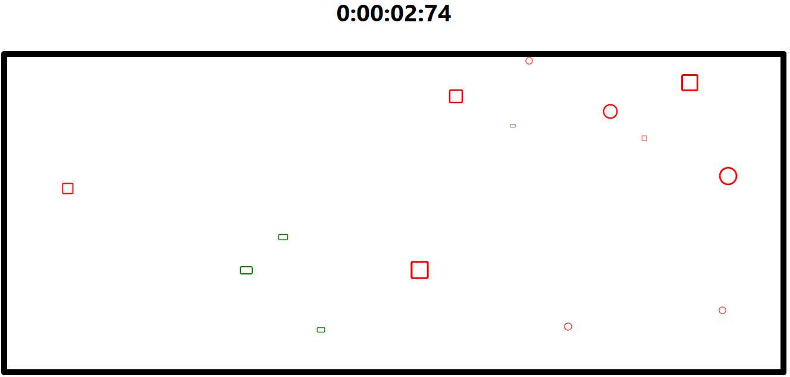

    <h1 style="text-align: center;">Mouse Race Game</h1>
    
     
    <a href="https://mouse-race.netlify.app">See the game in action!</a>

<h2>Description</h2>

Mouse Race Game is a simple web-based game where players need to click on elements appearing on the screen to collect them. The game involves different types of elements with specific behaviors, such as Collect, Avoid, and Change. The goal of the game is to collect all the Collect and Change elements while avoiding the Avoid elements to win.

<h2>Instructions</h2>
<ol>
    <li>Click the 'Start' button in the center of the screen to begin the game.</li>
    <li>Elements will appear randomly on the screen.</li>
    <li>Click on the Collect elements (green) to collect them.</li>
    <li>Avoid clicking on the Avoid elements (red) to prevent losing.</li>
    <li>The Change elements (square) alternate their behavior between Collect and Avoid.</li>
    <li>Make all the Collect and Change elements disappear to win the game.</li>
    <li>After finishing the game, submit your time to the leaderboard.</li>
</ol>

<h2>Features</h2>
<ul>
    <li><strong>Object-Oriented Architecture</strong>: Implemented using JavaScript classes to represent game elements.</li>
    <li><strong>Random Element Generation</strong>: Elements appear randomly on the screen with various behaviors.</li>
    <li><strong>Dynamic Element Movement</strong>: Elements move and change direction/color according to their behavior.</li>
    <li><strong>Stopwatch</strong>: A timer tracks the elapsed time during gameplay.</li>
    <li><strong>Server Storage</strong>: Utilized for saving player's time and displaying it on the leaderboard.</li>
</ul>

<h2>Dependencies</h2>
<ul>
    <li><strong>React</strong>: JavaScript library for building user interfaces.</li>
    <li><strong>Bootstrap</strong>: Front-end framework for designing responsive websites.</li>
    <li><strong>react-bootstrap</strong>: Bootstrap components built with React.</li>
    <li><strong>react-icons</strong>: Library for adding icons to React applications.</li>
    <li><strong>Express</strong>: Web framework for Node.js to build the backend server.</li>
    <li><strong>MySQL</strong>: Database for storing the leaderboard.</li>
</ul>

<h2>Algorithms</h2>
<ul>
    <li><strong>Random Number Generation</strong>: Used to determine the number of elements and their positions.</li>
    <li><strong>Interval-based Movement</strong>: Elements move at regular intervals based on their behavior.</li>
</ul>

<h2>Setup and Installation</h2>

Follow these steps to set up the project for the first time:

<ol>
    <li><strong>Clone the repository:</strong>
        <pre><code>git clone https://github.com/PeriAmiga/mouse-race.git
cd mouse-race</code></pre>
    </li>
    <li><strong>Install dependencies:</strong>
        <pre><code>npm install</code></pre>
    </li>
    <li><strong>Configure Database Settings:</strong>
        
Edit the file <code>src/db/dbSettings.js</code> with your MySQL details

    </li>
    <li><strong>Create the Database:</strong>
        
Open a terminal and run:

        <pre><code>node src/db/dbCreation.js</code></pre>
    </li>
    <li><strong>Create the Table:</strong>
        
In the same terminal, run:

        <pre><code>node src/db/tableCreation.js</code></pre>
    </li>
    <li><strong>Start the Backend Server:</strong>
        
In the same terminal, run:

        <pre><code>node src/back/server.js</code></pre>
    </li>
    <li><strong>Start the Frontend Server:</strong>
        
Open another terminal and run:

        <pre><code>npm start</code></pre>
    </li>
</ol>

<h2>Running the Project</h2>

After the initial setup, you can start the project with the following steps:

<ol>
    <li>Start the backend server:
        <pre><code>node src/back/server.js</code></pre>
    </li>
    <li>Start the frontend server:
        <pre><code>npm start</code></pre>
    </li>
</ol>